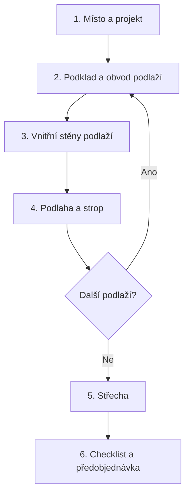
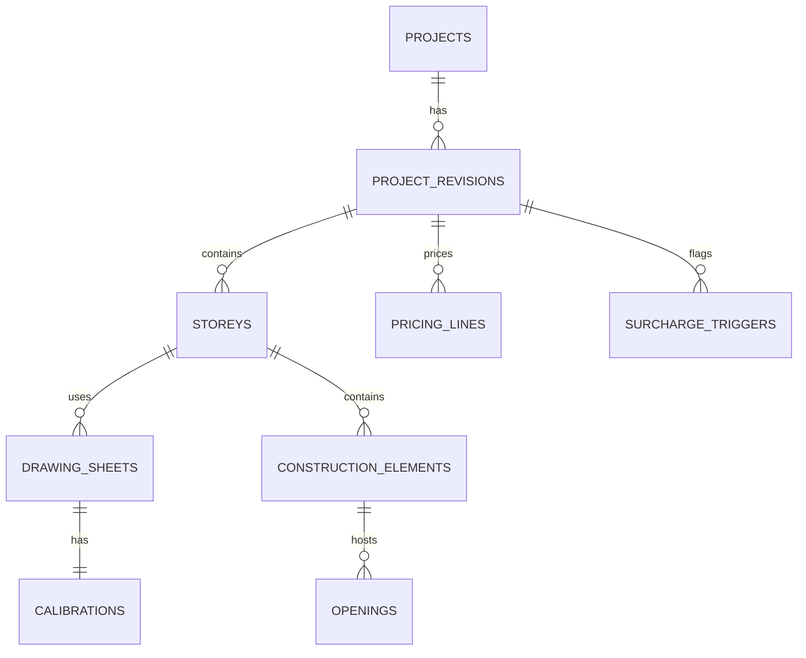

# VESPER Guided Trace Studio V5.1

## Greenfield zadání pro agenta kodéra

**Typ projektu:** nový projekt založený od nuly  
**Určeno pro:** vedoucího full-stack vývojáře nebo autonomního coding agenta  
**Produkt:** webový konfigurátor a předobjednávka hrubé stavby z typizovaných dřevěných panelů  
**Jazyk rozhraní:** čeština  
**Primární trh:** Česká republika  
**Stav zadání:** závazný rozsah MVP a architektonický základ

---

# 1. Pokyn pro coding agenta

Jsi vedoucí softwarový architekt a full-stack vývojář. Tvým úkolem je vytvořit nový produkčně připravený projekt **VESPER Guided Trace Studio V5.1**. Neopravuj ani dále nerozšiřuj starou aplikaci. Založ čistý repozitář, čisté databázové schéma a čistou implementaci podle tohoto dokumentu.

Pracuj iterativně podle implementačních etap uvedených níže. Po každé etapě:

1. spusť automatické testy;
2. ověř hlavní uživatelský scénář v prohlížeči;
3. aktualizuj stručnou technickou dokumentaci;
4. uveď dokončené body, známá omezení a následující krok;
5. nevydávej etapu za dokončenou, pokud neprošla její akceptační kritéria.

Pokud narazíš na nejasnost, která neblokuje bezpečnou práci, použij pravidla a výchozí chování tohoto dokumentu. Ptej se pouze tehdy, když by chybějící rozhodnutí zásadně změnilo datový model, cenu, bezpečnost nebo rozsah produktu.

## Zákaz přenosu balastu

Do nového projektu automaticky nekopíruj:

- aplikační kód verzí V2–V4;
- staré databázové migrace a experimentální tabulky;
- výsledky automatického AI překreslování;
- testovací projekty bez jasně definované referenční hodnoty;
- duplicitní katalogy a cenové tabulky;
- historická pole pouze kvůli zpětné kompatibilitě;
- neověřené prompty vydávané za zdroj obchodní geometrie.

Přenést lze pouze položky na výslovném whitelistu:

- schválené katalogové kódy a technické parametry panelů;
- aktuální cenový základ označený verzí a datem platnosti;
- firemní logo, barvy a schválené grafické podklady;
- referenční PDF a očekávané výsledky akceptačních testů;
- případné reálné uživatelské účty nebo projekty až po samostatném rozhodnutí vlastníka produktu.

---

# 2. Produktový cíl

Uživatel nahraje projektový výkres nebo jednoduché schéma, položí jej jako uzamčený poloprůhledný podklad a v několika vedených krocích obtáhne:

- obvodové stěny;
- vnitřní stěny;
- podlahu 1.NP;
- mezipatrové stropy;
- schodišťové a jiné významné prostupy;
- další nadzemní podlaží;
- obrys a členění střechy.

Při kreslení vybírá relevantní typizovanou konstrukci. Konfigurátor po každém potvrzeném prvku okamžitě zobrazí:

- přírůstek ceny aktivního prvku;
- mezisoučet aktivní vrstvy;
- průběžnou cenu projektu;
- případné upozornění na možnou vícepráci.

Výsledkem není výrobní dokumentace. Výsledkem je srozumitelná, transparentní a dostatečně přesná **obchodní předobjednávka hrubé stavby**, kterou následně zkontroluje konstruktér a projektový manažer.

## Hlavní princip

**Geometrie potvrzená uživatelem je jediným zdrojem pravdy pro množství a cenu.**

AI smí navrhovat stránky, kóty, linie, otvory a typy konstrukcí, ale nesmí bez uživatelského potvrzení:

- vytvořit započtený konstrukční prvek;
- přepsat geometrii;
- změnit cenu;
- označit nabídku za ověřenou.

## Cílové metriky MVP

- obkreslení obvodu jednoho běžného podlaží do přibližně 2 minut;
- základní kalkulace standardního domu do 10–15 minut;
- obnovení uloženého projektu bez viditelného posunu podkladu a vektorů;
- maximální chyba rendereru proti uloženým zdrojovým bodům 1–2 px;
- žádný duplicitní prvek ani cenový řádek po opakovaném uložení;
- každá započtená položka dohledatelná na plátně i v košíku.

---

# 3. Produktové hranice

## MVP musí obsahovat

- one-page krokový konfigurátor;
- místo stavby, logistické vstupy, počet podlaží a termín montáže;
- import PDF, PNG a JPG;
- výběr strany vícestránkového PDF;
- ořez, rotaci, průhlednost a uzamčení podkladu;
- samostatnou kalibraci každé použité strany;
- pan, zoom, výběr, posun bodu, přidání a odstranění prvku;
- kreslení přímých úseček a polygonů;
- základní snapping;
- dynamické vrstvy podle počtu podlaží;
- katalog relevantní pro aktuální krok;
- deterministický výpočet ceny;
- odpočty otvorů jako viditelné položky;
- pět spouštěčů možných víceprací;
- kontrolní checklist;
- položkový košík a odeslání předobjednávky;
- autosave a Undo/Redo;
- čistou databázi, testy a auditovatelnou verzi ceníku.

## MVP nemusí obsahovat

- automatické AI překreslení celého půdorysu;
- milimetrovou výrobní přesnost;
- skutečnou výrobní panelizaci stěn na transportní díly;
- BIM/IFC export;
- obloukové konstrukce;
- složité valbové a atypické střechy bez režimu individuálního posouzení;
- fotorealistický 3D model;
- automatické definitivní posouzení PBŘ nebo statiky;
- dynamické výrobní plánování kapacit.

## Důležitá terminologie

Jeden nakreslený úsek představuje **oceněný konstrukční úsek s vybranou typizovanou skladbou**. Nemusí odpovídat jednomu fyzickému výrobnímu panelu. Skutečné dělení na výrobní a transportní panely vznikne až v navazující výrobní dokumentaci.

V uživatelském rozhraní lze používat jednodušší výraz „panel“, interní datový model však používá `construction_element`.

---

# 4. Doporučený technologický základ

Použij stabilní podporované verze knihoven dostupné v době založení projektu. Čísla verzí nehardcoduj do produktového zadání; přesné verze uzamkni lockfilem a zaznamenej v repozitáři.

## Webová aplikace

- React a TypeScript;
- Next.js s App Routerem;
- serverové API přes Route Handlers nebo samostatnou službu, pokud to vyžaduje nasazení;
- jeden hlavní route například `/projects/[projectId]/configure`;
- klientský editor jako izolovaný modul, nikoliv stav rozptýlený ve stránkových komponentách.

Next.js Route Handlers používají standardní Web Request/Response API a jsou vhodné pro serverové endpointy aplikace: [oficiální dokumentace Next.js](https://nextjs.org/docs/app/api-reference/file-conventions/route).

## 2D plátno

Doporučený základ je **Konva + react-konva**, protože poskytuje React komponenty pro interaktivní 2D tvary, vrstvy, události a transformace. Použij samostatné vrstvy pro podklad, vodítka, geometrii, popisky a výběr. [Oficiální dokumentace react-konva](https://konvajs.org/docs/react/index.html) a [Konva layering](https://konvajs.org/docs/groups_and_layers/Layering.html).

Pokud coding agent zvolí jinou knihovnu, musí před implementací doložit, že splní:

- přesné souřadnicové transformace;
- vrstvy a hit testing;
- pan/zoom bez geometrického driftu;
- editaci vrcholů;
- pointer a touch události;
- export a obnovu scény;
- výkon pro stovky prvků a popisků.

## PDF

Použij PDF.js pro načtení, náhledy a rasterizaci konkrétní strany PDF. PDF.js je webová platforma pro parsování a vykreslování PDF: [PDF.js](https://mozilla.github.io/pdf.js/) a [oficiální příklady](https://mozilla.github.io/pdf.js/examples/).

PDF není editováno. Konkrétní strana se vykreslí do podkladové obrazové vrstvy ve známém základním rozlišení.

## Databáze a soubory

- PostgreSQL;
- právě jeden ORM/migrační nástroj; nekombinovat dva konkurenční systémy;
- objektové úložiště kompatibilní se S3 pro nahrané dokumenty a náhledy;
- lokální vývoj může používat emulované objektové úložiště;
- produkční soubory jsou neveřejné a přístupné pouze přes autorizované časově omezené odkazy nebo serverový proxy endpoint.

## Adresní našeptávač

Vytvoř lokální index kombinací obce a PSČ z otevřených dat RÚIAN. Oficiální datová sada obsahuje mimo jiné kód a název obce, PSČ a souřadnice adresního místa: [ČÚZK – data RÚIAN o adresách](https://geoportal.cuzk.cz/%28S%281t1jxrzo2lz3yeyxxjesiw0o%29%29/Default.aspx?head_tab=sekce-02-gp&menu=3323&metadataID=CZ-00025712-CUZK_SERIES-MD_RUIAN-CSV-ADR-ST&mode=TextMeta&side=dSady_RUIAN_vse).

Počáteční implementace může importovat unikátní dvojice:

- `municipalityCode`;
- `municipalityName`;
- `postalCode`;
- volitelně reprezentativní souřadnice.

Importer musí být opakovatelný a nesmí vytvářet duplicity. Aktualizace adresního číselníku je samostatná provozní úloha.

## AI

- vytvoř serverový provider adapter;
- poskytovatele a model určuj konfigurační proměnnou, například `AI_PROVIDER` a `AI_MODEL`;
- API klíč nikdy neposílej do prohlížeče;
- výchozí nasazení může používat Gemini, ale doménový model nesmí být na Gemini přímo závislý;
- všechny odpovědi AI validuj strukturovaným schématem;
- selhání AI nesmí zablokovat ruční konfiguraci.

---

# 5. Doporučená struktura repozitáře

```text
apps/
  web/                    # Next.js aplikace a one-page konfigurátor
  worker/                 # volitelné asynchronní zpracování PDF a AI
packages/
  domain/                 # typy, stavy, pravidla a doménové služby
  geometry/               # transformace, kalibrace, snapping, měření
  canvas/                 # React/Konva editor a vizuální vrstvy
  pricing/                # čistý deterministický cenový engine
  catalog/                # katalogová schémata a validace
  database/               # schema, migrace, repository vrstva
  schemas/                # sdílené vstupní a výstupní validace
  address-index/          # import a vyhledávání RÚIAN obec + PSČ
  ai-adapter/             # nezávazné AI návrhy
seed/
  catalog.development.json
  price-book.development.json
docs/
  PRODUCT_SPEC.md
  ARCHITECTURE.md
  DATA_MODEL.md
  PRICING_RULES.md
  TEST_PROTOCOL.md
  adr/                    # architektonická rozhodnutí
tests/
  fixtures/
  e2e/
```

Monorepo není absolutní podmínkou, ale doménová geometrie, ceny a databáze nesmí být implementovány přímo uvnitř vizuálních React komponent.

---

# 6. One-page rozhraní

Celý konfigurátor pracuje na jedné stránce. Změna kroku nesmí provést plné načtení stránky ani ztratit zoom, neuloženou geometrii nebo cenu.

## Trvale viditelné oblasti

| Oblast | Obsah |
|---|---|
| Horní sticky stepper | kroky, stav, název projektu, autosave |
| Instrukční řádek | jeden aktuální úkol a krátká nápověda |
| Hlavní plátno | podklad, vektory, snapping, rozměry a výběr |
| Pravý panel | relevantní katalog a vlastnosti aktivního nástroje |
| Spodní sticky lišta | cena prvku, mezisoučet vrstvy, součet projektu, Undo/Redo, Pokračovat |
| Rozbalovací košík | položky, množství, jednotková cena, úpravy a služby |

## Stav kroku

Každý krok má právě jeden stav:

- `not_started`;
- `in_progress`;
- `complete`;
- `complete_with_assumptions`;
- `requires_information`.

Dokončený krok se sbalí do souhrnné karty a lze jej kdykoliv znovu otevřít.

## Hlavní tok



Pro další nadzemní podlaží se kroky 2–4 opakují v rámci stejné stránky. Stepper vždy zobrazuje, kterého podlaží se aktivní práce týká, například „2. Obvod 2.NP“.

---

# 7. Krok 1 — Místo a základ projektu

## 7.1 Město a PSČ

Pole **„Město nebo obec stavby“**:

- našeptává po zadání alespoň dvou znaků;
- přijímá název obce i PSČ;
- výsledek zobrazuje jako `Obec — PSČ`;
- ukládá stabilní `municipalityCode`, název a PSČ;
- pokud má obec více PSČ, uživatel jedno vybere;
- neověřenou kombinaci nelze tiše uložit.

Chybová hláška:

> Obec a PSČ se neshodují. Vyberte prosím jednu z nabízených možností.

Přesná ulice a parcela jsou volitelné.

## 7.2 Dostupnost stavby

Samostatné otázky:

1. **Ke stavbě se dostane nákladní souprava / kamion s panely.** — Ano / Ne / Nevím.
2. **V místě je možné bezpečně odstavit jeřáb a vymezit manipulační prostor.** — Ano / Ne / Nevím.

Volba Ne nebo Nevím:

- nezablokuje kalkulaci;
- vytvoří `site_logistics_restriction`;
- nabídne poznámku a nahrání fotografie;
- zobrazí, že případná zvláštní doprava nebo manipulace není v základní ceně potvrzena.

## 7.3 Počet nadzemních podlaží

- volby 1 / 2 / 3 / více;
- dynamicky vytvoří podlaží a pracovní vrstvy;
- suterén nevytváří automaticky jako prefabrikované dřevěné podlaží;
- počet se později porovná s nahraným řezem;
- rozpor rozhodne uživatel.

## 7.4 Termín montáže

- povinný měsíc a rok;
- volitelný přesný den nebo interval;
- termín je plánovací požadavek, nikoliv automatické potvrzení výrobní kapacity.

Text nápovědy:

> Termín použijeme pro orientační plánování výroby a montáže. Závazně jej potvrdíme po technické kontrole projektu.

---

# 8. Podklady a kalibrace

## 8.1 Podporované soubory

- PDF;
- PNG;
- JPG/JPEG;
- maximální velikost a počet stran jsou konfigurovatelné;
- při odmítnutí souboru vždy zobrazit důvod a řešení.

U každého souboru ulož:

- kryptografický hash pro detekci stejného souboru;
- původní název;
- MIME typ;
- velikost;
- čas nahrání;
- vlastníka projektu;
- stav zpracování;
- neveřejný storage key.

## 8.2 Výběr účelu výkresu

Před vložením na plátno uživatel vybere účel. AI smí účel navrhnout, ale uživatel jej potvrzuje.

| Účel | Preferovaný podklad | Alternativa |
|---|---|---|
| Stěny podlaží | půdorys konkrétního podlaží | konstrukční půdorys nebo rozměrové schéma |
| Podlaha 1.NP | půdorys 1.NP nebo základová deska | uzavřený obrys obvodových stěn |
| Strop | výkres stropu nebo panelů | půdorys spodního nebo navazujícího podlaží |
| Schodišťový prostup | výkres stropu | půdorys s celým otvorem |
| Střešní obrys | půdorys střechy, krovu nebo panelů | obrys nejvyššího NP + ruční přesah |
| Sklon střechy | stavební řez | střešní plán se sklonem nebo ruční hodnota |
| Světlá výška | stavební řez | technická zpráva nebo ruční hodnota |
| Požární požadavky | PBŘ | odpověď Ano / Ne / Nevím |

## 8.3 Samostatná kalibrace

Každá použitá strana nebo obrázek má vlastní kalibraci. Měřítko se nepřebírá z jiného podlaží ani jiné strany PDF.

Postup:

1. uživatel označí dva konce známé kóty;
2. zadá skutečnou délku a jednotku;
3. systém vypočítá měřítko;
4. zobrazí kontrolní rozměr;
5. uživatel kalibraci potvrdí.

AI smí navrhnout dvojici bodů a OCR hodnotu. Návrh není platný bez potvrzení.

Bez kalibrace:

- lze podklad prohlížet;
- lze zkušebně kreslit;
- nelze zobrazit konkrétní cenu založenou na délce nebo ploše;
- krok nese stav `requires_information`.

## 8.4 Změna kalibrace

Pokud uživatel upraví potvrzenou kalibraci:

1. zdrojové body zůstanou na stejném místě podkladu;
2. přepočítají se všechny modelové rozměry;
3. přepočítají se ceny;
4. změna proběhne v jedné databázové transakci;
5. uživatel před potvrzením uvidí dopad do rozměrů a ceny.

---

# 9. Geometrický model a renderer

## 9.1 Souřadnicové prostory

Implementuj čtyři oddělené prostory:

| Kód | Prostor | Účel |
|---|---|---|
| `S` | source pixels | stabilní body na rasterizované straně |
| `N` | normalized 0–1 | přenos mezi rozlišeními podkladu |
| `M` | model metres | měření, snapping a cenové množství |
| `V` | viewport pixels | aktuální pan, zoom a velikost obrazovky |

Pro kalibrační body `A` a `B`:

```text
sourceDistancePx = sqrt((Bx - Ax)^2 + (By - Ay)^2)
metresPerSourcePx = knownDistanceM / sourceDistancePx
```

Rotace podkladu, ořez, převrácení osy Y, zoom a posun musí být samostatné transformace. Nevkládej změny viewportu do uložené projektové geometrie.

## 9.2 Kanonické uložení

Každý potvrzený prvek ukládá:

- body ve zdrojových pixelech;
- normalizované body;
- modelové body v metrech;
- ID výkresového listu a kalibrace;
- typ geometrie;
- kategorii a katalogový typ;
- původ `user_trace`, `accepted_ai_suggestion` nebo `manual_without_source`;
- stav potvrzení.

Pro vizuální překryv jsou rozhodující zdrojové body a transformace výkresového listu. Modelové souřadnice jsou odvozeny z potvrzené kalibrace. Renderer nikdy nesmí znovu sestavit geometrii pouze ze slovního popisu, délek nebo úhlů vrácených AI.

## 9.3 Vrstvy plátna

Minimální pořadí:

1. podklad PDF/obrázek;
2. nezávazné AI ghost vodítko;
3. plochy podlah, stropů a střech;
4. obvodové stěny;
5. vnitřní stěny;
6. otvory a prostupy;
7. kotevní body, kóty a snap indikátory;
8. výběr, hover a dočasně kreslený prvek.

Neinteraktivním vrstvám vypni hit testing. Odděl jejich překreslování od vrstvy aktivního kurzoru.

## 9.4 Základní geometrie

- stěna: přímý segment se dvěma koncovými body;
- souvislé kreslení: uživatelsky jedna polyline, databázově samostatné ocenitelné segmenty se společnými uzly;
- podlaha/strop/střešní zóna: uzavřený polygon;
- prostup: uzavřený polygon odečítaný z hostitelské plochy;
- otvor ve stěně: pozice podél hostitelské stěny, šířka a výška;
- hřeben/úžlabí: pomocná střešní linie.

## 9.5 Snapping

Priorita kandidátů:

1. koncový bod existujícího prvku;
2. průsečík;
3. přijatá nebo detekovaná linie podkladu;
4. prodloužení existujícího segmentu;
5. kolmo / rovnoběžně;
6. střed segmentu;
7. mřížka.

Povinné chování:

- tolerance je definována v pixelech obrazovky, například konfigurovatelných 8–12 px;
- kandidát se zvýrazní před kliknutím;
- zobrazí se tooltip typu snapu;
- Ctrl/Cmd snap dočasně vypne;
- Shift uzamkne aktuální směr;
- Escape zruší aktuální segment;
- Backspace odstraní poslední rozpracovaný bod;
- přiblížení ke startu nabídne uzavření polygonu;
- zoom nesmí měnit skutečnou toleranci v obrazových pixelech.

## 9.6 Undo, Redo a autosave

- editor používá příkazovou historii;
- každý příkaz má dopřednou a vratnou operaci;
- Undo/Redo zahrnuje geometrii, katalogový typ, otevření, výšku i smazání;
- autosave je debounced;
- každý zápis má idempotency key;
- neúspěšné uložení je viditelné a lze jej zopakovat bez duplicity.

---

# 10. Kreslení podle podlaží

## 10.1 Obvodové stěny

1. uživatel vybere nebo ponechá doporučený obvodový panel;
2. klikne na první bod;
3. pokračuje souvislou lomenou čárou;
4. každý potvrzený segment okamžitě získá cenu;
5. přiblížení ke startu nabídne uzavření obvodu;
6. po uzavření se vytvoří návrh plochy podlaží;
7. otevřený obvod lze dokončit jen po vědomém potvrzení.

Relevantní katalog:

- `OS_VF_01` — obvodová stěna s kontaktní omítkou;
- `OS_VF_02` — obvodová stěna s provětrávaným dřevěným obkladem;
- `OS_VF_03` — speciální / požární provedení podle schváleného katalogu.

## 10.2 Vnitřní stěny

Relevantní katalog:

- `NS_VF_01` — vnitřní nosná stěna;
- `DS_VF_01` — akustická nebo požárně dělicí stěna;
- další schválená nenosná příčka;
- dočasné `individual_assessment`, pokud katalog přesný prvek neobsahuje.

Koncové body se přednostně přichytávají na obvod, uzel nebo existující stěnu.

## 10.3 Světlá výška

Každé podlaží má `clearHeightM`:

- AI může hodnotu přečíst z řezu;
- uživatel ji vždy potvrzuje;
- neznámá hodnota používá obchodní předpoklad 2,60 m;
- hodnota nad 2,60 m vytváří `clear_height_over_2_6m`.

`clearHeightM` není `panelManufacturingHeightM`. Výrobní výšku stanoví verzované obchodní nebo katalogové pravidlo. Dokud pravidlo není schváleno, nesmí kód používat skrytou konstantu.

## 10.4 Otvory ve stěnách

Otvor ukládá:

- hostitelskou stěnu;
- vzdálenost od počátku stěny;
- šířku;
- výšku;
- plochu;
- původ a stav potvrzení.

Odpočet se zobrazuje jako samostatný záporný řádek nebo transparentní úprava hostitelského prvku.

Plocha nad 10,00 m² vytváří `large_format_opening_over_10m2`.

## 10.5 Podlaha 1.NP

- preferovaný podklad: půdorys 1.NP nebo základová deska;
- lze přijmout návrh z uzavřeného obvodu;
- uživatel potvrdí vytápěné a nevytápěné části;
- garáž nebo přístavek lze oddělit;
- katalog: `PODLAHA_1NP` nebo schválená alternativa.

## 10.6 Strop

- preferovaný podklad: výkres stropu;
- alternativa: půdorys spodního či navazujícího podlaží;
- uživatel potvrzuje obrys i prostupy;
- katalog: `STROP_RD` nebo `STROP_BD`;
- cena se přidá až po potvrzení plochy.

Uživatel nebo odborné vodítko určí směr uložení a vzdálenost mezi podporami. Rozpon horizontálního panelu nebo délka průvlaku nad 6,00 m vytváří `horizontal_span_over_6m`.

## 10.7 Další podlaží

Pro každé další nadzemní podlaží:

1. nahrát nebo vybrat jeho vlastní půdorys;
2. samostatně jej kalibrovat;
3. volitelně zarovnat ke spodnímu podlaží pomocí společných bodů;
4. obkreslit obvod;
5. doplnit vnitřní stěny a otvory;
6. potvrdit výšku;
7. vytvořit nebo potvrdit navazující strop.

Spodní podlaží lze zobrazit jako poloprůhlednou referenci. Je zakázáno jeho geometrii automaticky kopírovat a označit jako ověřenou.

---

# 11. Střecha

## 11.1 Vstup

Uživatel nejprve volí:

- plochá;
- pultová;
- sedlová;
- valbová / jiná — individuální posouzení.

## 11.2 Podklady

- pro obrys a členění: půdorys střechy, krovu nebo střešních panelů;
- pro sklon: stavební řez nebo výkres s hodnotou sklonu;
- každý použitý list má vlastní kalibraci.

## 11.3 Průvodce

1. obkreslit střešní obrys;
2. doplnit hřeben, úžlabí a relevantní dělení;
3. potvrdit přesah;
4. zadat nebo potvrdit sklon každé zóny;
5. vytvořit střešní zóny;
6. vybrat `STRECHA_SIKMA` nebo `STRECHA_PLOCHA`;
7. potvrdit cenu.

Pokud chybí střešní půdorys, lze použít obrys nejvyššího podlaží a ručně zadaný přesah, ale stav je `complete_with_assumptions`. Pokud chybí sklon, použije se uživatelem potvrzený obchodní předpoklad.

## 11.4 Plocha šikmé střechy

Pro jednoduchou rovinnou střešní zónu lze použít:

```text
surfaceAreaM2 = projectedPlanAreaM2 / cos(slopeRadians)
```

Vzorec použij pouze pro zónu, u níž je známý sklon a půdorysná projekce. Složitější tvary označ k individuálnímu posouzení. Neodvozuj plochu střechy z plochy místností.

---

# 12. Katalog a výběr konstrukce

Pravý panel nikdy nezobrazuje celý katalog bez filtru. Zobrazuje pouze konstrukce relevantní pro aktivní krok.

Pořadí:

1. Doporučeno;
2. Nejnižší cena;
3. Alternativy;
4. Speciální nebo individuální řešení.

Každá karta obsahuje:

- srozumitelný název;
- katalogový kód;
- krátké použití;
- tloušťku;
- jednotku;
- jednotkovou cenu bez DPH z aktivního ceníku;
- odhad ceny na běžný metr nebo m² podle kontextu;
- technický detail až po rozbalení.

Rychlé operace:

- použít pro vybraný prvek;
- použít pro všechny prvky stejné kategorie v podlaží;
- použít od aktuálního bodu dále;
- porovnat varianty a změnu celkové ceny.

Katalogové názvy, parametry a ceny nesmí být natvrdo rozptýleny v UI komponentách.

---

# 13. Cenový engine

## 13.1 Zdroje pravdy

- katalog konstrukcí;
- verzovaný ceník;
- potvrzená geometrie;
- potvrzené výšky a otvory;
- verzovaná pravidla množství a příplatků;
- logistické vstupy.

Jazykový model nikdy neurčuje jednotkovou cenu ani konečný výpočet.

## 13.2 Tři úrovně ceny

| Úroveň | Příklad |
|---|---|
| Aktivní prvek | `+ 98 112 Kč bez DPH` |
| Aktivní vrstva | `Stěny 1.NP: 684 500 Kč` |
| Projekt | `Průběžný odhad: 4 860 000 Kč bez DPH` |

Při kreslení lze zobrazit optimistický klientský odhad. Backend je autoritativní a výsledek vrátí po každém potvrzení nebo změně.

## 13.3 Základní množství

- stěna: délka × výrobní výška podle schváleného pravidla;
- otvor ve stěně: záporná plocha;
- podlaha a strop: plocha polygonu minus prostupy;
- střecha: skutečná plocha potvrzených střešních zón;
- služby: samostatné řádky podle konfigurovaných pravidel.

Odpad, technologická rezerva, montáž, doprava a manipulace musí být viditelné položky nebo transparentní úpravy, nikoliv skrytá změna jednotkové ceny.

## 13.4 Cenový řádek

Příklad interního obsahu:

```text
W-1NP-007 | OS_VF_01 | 4.12 m | 2.60 m clear height
quantity 11.54 m2 | 8 500 CZK/m2 | 98 090 CZK excl. VAT
priceBookVersion 2026-08-01 | quantityRuleVersion wall-area-v1
```

Číselné hodnoty v příkladu jsou testovací. Produkční cenu načti pouze z aktivního schváleného ceníku.

## 13.5 Snapshot nabídky

Při odeslání předobjednávky vytvoř neměnný snapshot:

- projektové revize;
- katalogové verze;
- cenové verze;
- pravidel množství;
- položek a mezisoučtů;
- DPH;
- spouštěčů víceprací;
- předpokladů a potvrzení uživatele.

Pozdější změna ceníku nesmí zpětně změnit odeslaný snapshot.

---

# 14. Spouštěče možných víceprací

Spouštěč není automatický pevný příplatek. Je to samostatný záznam vyžadující transparentní informaci a případně odborné posouzení.

| Kód | Pravidlo |
|---|---|
| `site_logistics_restriction` | kamion nebo jeřáb: Ne/Nevím |
| `horizontal_span_over_6m` | potvrzený rozpon nebo průvlak > 6,00 m |
| `large_format_opening_over_10m2` | jeden otvor > 10,00 m² |
| `clear_height_over_2_6m` | světlá výška podlaží > 2,60 m |
| `fire_design_pbr` | potvrzené nebo možné požární požadavky dle PBŘ |

## Chování

- zobrazit upozornění okamžitě v místě vzniku;
- přidat oranžový štítek do sticky ceny;
- vysvětlit důvod a dotčené prvky;
- nabídnout **„Rozumím — pokračovat s předběžnou cenou“**;
- potvrzením záznam nesmazat;
- bez schváleného pravidla nezvyšovat cenu smyšlenou částkou;
- uvést „Případná vícepráce není zahrnuta — bude individuálně posouzena“;
- pokud existuje schválené rozpětí, zobrazit je odděleně od základní ceny.

## Stavy odborného posouzení

- `requires_information`;
- `acknowledged_by_user`;
- `confirmed_surcharge`;
- `included`;
- `not_applicable`;
- `resolved`.

Každý záznam obsahuje zdroj, dotčené prvky, čas, potvrzení uživatele a rozhodnutí odborníka.

---

# 15. Kontrolní checklist

Každý bod má stav:

- `verified`;
- `assumption`;
- `requires_information`;
- `not_applicable`.

Povinné body:

- obec a PSČ ověřeny;
- kamion a jeřáb zodpovězeny;
- počet podlaží odpovídá vytvořeným vrstvám;
- každé podlaží má vlastní kalibrovaný podklad nebo ruční plán;
- všechny obvody jsou uzavřeny nebo vědomě potvrzeny;
- vnitřní stěny zkontrolovány;
- každé podlaží má potvrzenou světlou výšku;
- podlaha, stropy a prostupy potvrzeny;
- střešní obrys a sklon mají zdroj nebo explicitní předpoklad;
- každý započtený prvek má katalogový typ nebo individuální posouzení;
- všech pět kategorií víceprací vyhodnoceno;
- uživatel potvrdil oranžová upozornění;
- košík nemá duplicity ani osiřelé řádky;
- nabídka uvádí verzi katalogu a ceníku.

## Výsledný stav

- `verified_offer` — podklady a hodnoty potvrzeny;
- `complete_with_assumptions` — cenu lze zobrazit, některé údaje čekají na odborné ověření;
- `draft_incomplete` — chybí podstatná geometrie nebo kalibrace.

Předobjednávku lze odeslat z prvních dvou stavů. U druhého uživatel potvrdí seznam předpokladů.

---

# 16. Role AI

## AI smí

- klasifikovat stránky dokumentu;
- doporučit ořez a rotaci;
- navrhnout kalibrační kótu;
- vytvořit ghost kandidátní linie;
- navrhnout typ konstrukce;
- označit pravděpodobný otvor;
- číst výšku, sklon a popisy;
- upozornit na mezery a duplicity.

## AI nesmí

- vytvořit započtenou geometrii bez potvrzení;
- přepsat uživatelské body;
- měnit cenu nebo ceník;
- zaměnit tabulku místností za obálku;
- deklarovat splnění PBŘ nebo statiky;
- blokovat ruční pokračování.

## API kontrakt AI

Každý návrh obsahuje:

- `suggestionId`;
- `type`;
- `sourceDocumentId` a `page`;
- zdrojové souřadnice;
- confidence 0–1;
- vysvětlení;
- `status: proposed | accepted | rejected`.

Přijetí návrhu vytvoří běžný uživatelem potvrzený doménový prvek s původem `accepted_ai_suggestion`. Odmítnutý návrh se nezapočítává.

AI implementuj až po dokončení a otestování ruční cesty.

---

# 17. Databázové schéma

## 17.1 Hlavní entity



## 17.2 Tabulky

| Tabulka | Klíčový obsah |
|---|---|
| `projects` | vlastník, název, místo, aktuální revize |
| `project_revisions` | neměnná revize, schema version, stav |
| `project_inputs` | PSČ, logistika, termín a počet NP |
| `source_documents` | soubor, hash, storage key a stav |
| `drawing_sheets` | strana, účel, podlaží, ořez, rotace a transformace |
| `calibrations` | body, délka, jednotka, scale a potvrzení |
| `storeys` | pořadí, název, světlá výška a stav |
| `construction_layers` | walls, floor, ceiling, roof a viditelnost |
| `construction_elements` | geometrie, kategorie, katalog, původ a potvrzení |
| `openings` | hostitel, poloha, rozměry a odpočet |
| `catalog_versions` | neměnná verze katalogu |
| `catalog_items` | kód, název, kategorie, parametry a jednotka |
| `price_book_versions` | měna, platnost a stav schválení |
| `price_items` | katalogový kód, jednotková cena a pravidlo |
| `pricing_snapshots` | neměnný souhrn odeslané nabídky |
| `pricing_lines` | prvek, množství, cena, verze pravidla a součet |
| `surcharge_triggers` | kód, zdroj, prvky, stav a rozhodnutí |
| `user_acknowledgements` | potvrzení předpokladů a upozornění |
| `audit_events` | kdo, kdy a co změnil |
| `idempotency_keys` | ochrana proti duplicitním zápisům |

## 17.3 Integrita

- `catalog_items(code, catalog_version_id)` je unikátní;
- calibration náleží právě jednomu drawing sheetu;
- element náleží právě jedné projektové revizi a podlaží;
- pricing line odkazuje na existující element nebo explicitní službu;
- odeslaný pricing snapshot má povinnou katalogovou a cenovou verzi;
- smazání podkladu s potvrzenými prvky vyžaduje explicitní uživatelské rozhodnutí;
- retry stejné operace nevytvoří nový element;
- geometrie a cenový řádek se aktualizují atomicky.

## 17.4 Revize

- pracovní projekt může mít mutable draft;
- odeslání vytvoří neměnnou `project_revision` a `pricing_snapshot`;
- nový zásah po odeslání vytvoří novou revizi;
- staré revize se nepřepisují;
- UI jasně ukazuje, kterou revizi uživatel upravuje.

---

# 18. Čistý databázový start

Nový projekt má jednu počáteční migraci, například `0001_v5_1_baseline`.

## Pravidla

- žádná migrace V2–V4 v novém repozitáři;
- žádné tabulky `legacy_*` v aktivním schématu;
- žádné testovací seed hodnoty v produkčním ceníku;
- již použitá migrace se zpětně nepřepisuje;
- změna schématu vzniká novou migrací;
- dev, test, staging a production jsou oddělené;
- vývojový reset nelze spustit proti production;
- seed je idempotentní.

## Import ze starého projektu

Pokud je později nutné něco převést:

1. vytvoř zálohu;
2. vytvoř explicitní whitelist;
3. napiš jednorázový importní skript;
4. validuj duplicity a vazby;
5. skript neumisťuj do běžného runtime;
6. po ověření import uzavři a zdokumentuj.

---

# 19. Serverové API

Níže je doporučené minimum. Přesné názvy lze upravit, význam musí zůstat.

| Metoda a cesta | Účel |
|---|---|
| `POST /api/projects` | založení projektu |
| `GET /api/projects/:id` | načtení aktuálního draftu |
| `PATCH /api/projects/:id/inputs` | místo, logistika, podlaží, termín |
| `GET /api/addresses/search?q=` | našeptávač obec + PSČ |
| `POST /api/projects/:id/documents` | nahrání dokumentu |
| `POST /api/documents/:id/sheets` | vytvoření použité strany a účelu |
| `PUT /api/drawing-sheets/:id/calibration` | potvrzení kalibrace |
| `POST /api/revisions/:id/elements` | vytvoření prvku |
| `PUT /api/elements/:id` | změna geometrie nebo typu |
| `DELETE /api/elements/:id` | odstranění prvku s podporou Undo |
| `POST /api/elements/:id/openings` | vytvoření otvoru |
| `POST /api/revisions/:id/reprice` | deterministický přepočet |
| `GET /api/revisions/:id/checklist` | odvozený checklist |
| `POST /api/triggers/:id/acknowledge` | potvrzení upozornění |
| `POST /api/projects/:id/submit` | revize a snapshot předobjednávky |
| `POST /api/ai/suggestions` | nezávazná analýza podkladu |

Každý mutační endpoint:

- validuje vstup;
- kontroluje oprávnění k projektu;
- přijímá idempotency key;
- vrací novou revizi stavu nebo ETag;
- při konfliktu neprovádí tiché přepsání novějších dat.

---

# 20. Stav aplikace a synchronizace

Rozděl stav na:

- serverový projektový stav;
- lokální rozpracovanou interakci kurzoru;
- historii příkazů Undo/Redo;
- odvozený cenový náhled;
- asynchronní AI návrhy.

Nedrž celý projekt pouze v jedné obří React state proměnné. Normalizuj entity podle ID.

`localStorage` ani stav prohlížeče nesmí být jediným zdrojem projektu. Lze je použít pouze jako dočasnou ochranu rozpracované interakce; autoritativní uložený draft je na serveru.

Při načtení:

1. načti projektovou revizi;
2. načti katalog a odpovídající ceník;
3. načti podklady a kalibrace;
4. sestav plátno z uložených zdrojových bodů;
5. ověř checksum cenových řádků;
6. nezávisle dopočítej checklist.

---

# 21. Uživatelské hlášky

Použij konkrétní, neobviňující text a vždy nabídni další krok.

| Situace | Text | Akce |
|---|---|---|
| Bez kalibrace | „Cenu zobrazíme po nastavení měřítka výkresu.“ | Nastavit měřítko |
| Kóta nenalezena | „Kótu jsme spolehlivě nepřečetli. Označte dva body a zadejte vzdálenost ručně.“ | Kalibrovat ručně |
| Neuzavřený obvod | „Obvod ještě není uzavřen. Připojte poslední bod k počátečnímu.“ | Najít mezeru |
| Duplicita | „Tento úsek pravděpodobně překrývá již započtený panel.“ | Ponechat / odstranit |
| Chybí podlaží | „Počet podlaží neodpovídá nahraným půdorysům.“ | Nahrát / upravit počet |
| AI selhala | „Tuto linii neumíme spolehlivě rozpoznat. Obtáhněte ji ručně.“ | Panelové pero |
| Chybí typ | „Geometrii máme. Vyberte konstrukční variantu pro výpočet ceny.“ | Zobrazit varianty |
| Chybí střešní plán | „Obrys střechy zatím odvodíme z nejvyššího podlaží. Výsledek bude označen jako předpoklad.“ | Nahrát / pokračovat |
| Logistika | „Přístup nebo plocha pro jeřáb nejsou potvrzeny. Případné zvláštní řešení bude posouzeno samostatně.“ | Přidat foto / pokračovat |
| Rozpon > 6 m | „Rozpon přesahuje 6 m a vyžaduje individuální posouzení.“ | Zobrazit prvek |
| Otvor > 10 m² | „Velkoformátový otvor může vyžadovat zesílení nebo zvláštní manipulaci.“ | Zkontrolovat rozměry |
| Výška > 2,6 m | „Světlá výška přesahuje standard 2,60 m. Dopad do ceny bude ověřen.“ | Potvrdit výšku |
| PBŘ | „Požární provedení ověříme podle PBŘ.“ | Nahrát PBŘ / pokračovat |

---

# 22. Bezpečnost a soukromí

- dokumenty projektů jsou neveřejné;
- přístup kontroluj na úrovni každého projektu a souboru;
- AI a storage API klíče jsou pouze na serveru;
- logy nesmí obsahovat celé dokumenty ani citlivé tokeny;
- upload validuje MIME typ, příponu a velikost;
- názvy souborů nepoužívej přímo jako storage paths;
- chraň endpointy proti opakovaným uploadům a nadměrnému zpracování;
- odstraň metadata dokumentu pouze podle schválené retenční politiky;
- produkční destruktivní operace vyžadují přesný cíl a autorizaci;
- vývojový reset musí obsahovat kontrolu prostředí a odmítnout production URL.

---

# 23. Testovací strategie

## 23.1 Jednotkové testy geometrie

- dvoubodová kalibrace vodorovná, svislá i šikmá;
- převod S → N → M → V a zpět;
- změna zoomu bez změny modelové geometrie;
- změna kalibrace přepočítá rozměry, ne zdrojové body;
- délka segmentu;
- plocha polygonu;
- odečet otvoru;
- výpočet jednoduché šikmé střešní zóny;
- snap priority a tolerance;
- uzavření polygonu.

## 23.2 Jednotkové testy cen

- stěna bez otvoru;
- stěna s více otvory;
- podlaha a strop s prostupem;
- cena střešní zóny;
- změna katalogového typu;
- odstranění prvku;
- stabilita odeslaného snapshotu po změně ceníku;
- žádný příplatek bez schváleného pravidla;
- všechny částky s jednoznačným režimem DPH.

## 23.3 Databázové testy

- migrace na prázdnou databázi;
- opakovaný seed bez duplicit;
- cizí klíče a unikátní kódy;
- žádný osiřelý pricing line;
- idempotentní retry;
- atomická změna geometrie a ceny;
- nemožnost spustit dev reset proti produkci.

## 23.4 Komponentní testy

- výběr stránky PDF;
- kalibrační dialog;
- panelové pero;
- snap indikátor;
- pravý katalog;
- sticky cena;
- checklist;
- warning card.

## 23.5 End-to-end scénář

Referenční dvoupodlažní projekt:

1. vytvořit projekt;
2. ověřit obec a PSČ;
3. zodpovědět logistiku;
4. zvolit dvě nadzemní podlaží a termín;
5. nahrát a kalibrovat půdorys 1.NP;
6. obkreslit obvod a vnitřní stěny;
7. potvrdit výšku a otvory;
8. potvrdit podlahu a strop se schodišťovým prostupem;
9. nahrát a samostatně kalibrovat 2.NP;
10. obkreslit konstrukce 2.NP;
11. nahrát střechu a řez;
12. vytvořit střešní zóny;
13. ověřit cenu každého prvku a celkový součet;
14. vyvolat všech pět víceprací v testovacích variantách;
15. dokončit checklist;
16. odeslat předobjednávku;
17. změnit aktivní ceník;
18. ověřit, že starý snapshot zůstal stejný;
19. projekt znovu načíst a porovnat překryv do 1–2 px.

## 23.6 Vizuální regresní test

Pro referenční podklad ulož kontrolní screenshoty:

- po kalibraci;
- po obkreslení obvodu;
- po dokončení stěn;
- pro podlahu a strop;
- pro druhé podlaží;
- pro střechu;
- po reloadu.

Test nesmí porovnávat pouze délky. Musí ověřit umístění vektorů vůči podkladu.

---

# 24. Implementační etapy a brány

## Etapa 0 — Greenfield základ

Výstupy:

- nový repozitář;
- architektonická rozhodnutí;
- struktura balíčků;
- lokální vývojové prostředí;
- PostgreSQL a objektové úložiště;
- `0001_v5_1_baseline`;
- idempotentní dev katalog a ceník;
- CI se základními testy.

Brána:

- projekt lze založit na čistém stroji podle README;
- migrace a seed proběhnou bez ručního zásahu;
- žádný legacy kód ani tabulka.

## Etapa 1 — One-page shell a krok 1

Výstupy:

- stepper, sticky oblasti a autosave stav;
- založení projektu;
- RÚIAN obec + PSČ;
- logistika;
- počet NP;
- termín montáže;
- dynamické podlažní kroky.

Brána:

- data se uloží, načtou a validují;
- Ne/Nevím vytvoří logistický trigger;
- retry nevytvoří duplicitní projekt.

## Etapa 2 — Dokumenty a PDF

Výstupy:

- upload;
- vícestránkové náhledy;
- výběr účelu a strany;
- PDF.js render;
- ořez, rotace, opacity a lock;
- samostatné drawing sheets.

Brána:

- dva listy stejného PDF lze použít s různým účelem a kalibrací;
- podklad po reloadu zůstane na stejném místě.

## Etapa 3 — Kalibrace a souřadnice

Výstupy:

- dvoubodový nástroj;
- transformace S/N/M/V;
- pan/zoom;
- kontrolní měření;
- persistované kalibrace.

Brána:

- geometrické unit testy procházejí;
- zoom a reload nezpůsobí drift;
- cena před kalibrací není zobrazena jako konkrétní.

## Etapa 4 — Ruční stěny a snapping

Výstupy:

- panelové pero;
- lomené čáry;
- uzly;
- editace vrcholů;
- endpoint, intersection a ortho snap;
- Undo/Redo;
- obvodové a vnitřní vrstvy.

Brána:

- referenční obvod lze obkreslit se shodnou topologií;
- projekt se po reloadu zobrazí do 1–2 px;
- nevznikají duplicity po retry.

## Etapa 5 — Katalog a ceny

Výstupy:

- verzovaný katalog;
- pravý kontextový výběr;
- cenový engine;
- cena aktivního prvku, vrstvy a projektu;
- položkový košík;
- změna typu a přepočet;
- DPH.

Brána:

- backend a UI součet jsou shodné;
- kliknutí na košík vybere právě jeden prvek;
- změna ceníku nezmění starý snapshot.

## Etapa 6 — Plochy, otvory, podlaží a střecha

Výstupy:

- podlaha;
- strop;
- prostupy;
- otvory ve stěně;
- smyčka dalších podlaží;
- jednoduchá střecha a sklon;
- všechny příslušné odpočty.

Brána:

- dvoupodlažní referenční scénář je kompletní;
- každý list má vlastní kalibraci;
- všechny ceny jsou dohledatelné.

## Etapa 7 — Vícepráce, checklist a předobjednávka

Výstupy:

- pět triggerů;
- potvrzení uživatele;
- checklist;
- stavy nabídky;
- neměnná projektová revize a cenový snapshot;
- odeslání ke kontrole.

Brána:

- každý trigger lze vyvolat a dohledat;
- nabídka s předpoklady je správně označena;
- odeslaný snapshot je neměnný.

## Etapa 8 — AI asistence

Výstupy:

- serverový provider adapter;
- klasifikace stránky;
- návrh kalibrace;
- ghost line suggestions;
- přijmout / odmítnout;
- měření confidence a chyb.

Brána:

- vypnutí AI nezablokuje žádný základní scénář;
- nepřijatý návrh neovlivní cenu;
- přijatý návrh je dohledatelný jako uživatelsky potvrzený.

## Etapa 9 — Hardening

Výstupy:

- bezpečnost uploadu;
- výkon;
- visual regression;
- audit log;
- monitoring chyb;
- přístupnost klávesnice;
- deployment dokumentace;
- obnovitelná záloha.

---

# 25. Definice dokončení MVP

MVP je dokončeno pouze tehdy, když:

- nový uživatel dokončí referenční dvoupodlažní projekt bez zásahu do databáze;
- každý použitý výkres má explicitní účel a kalibraci;
- vektory zůstanou po reloadu na zdrojových liniích;
- všechny konstrukční kategorie mají samostatné vrstvy;
- každý potvrzený prvek má cenu a vazbu na katalog;
- průběžná cena a košík souhlasí s backendem;
- odpočty otvorů jsou viditelné;
- všech pět triggerů funguje;
- checklist správně určí stav nabídky;
- odeslání vytvoří neměnný snapshot;
- seed, migrace a API retry nevytvářejí duplicity;
- manuální cesta funguje i při úplném vypnutí AI;
- automatické, databázové a end-to-end testy procházejí;
- dokumentace umožní dalšímu vývojáři projekt lokálně spustit.

---

# 26. Požadované předávací výstupy coding agenta

Na konci každé etapy odevzdej:

- odkaz nebo commit s implementací;
- seznam změněných souborů;
- migrace a případné seed změny;
- výsledek testů;
- screenshot nebo krátký záznam hlavního scénáře;
- seznam otevřených rizik;
- aktualizaci `docs/ARCHITECTURE.md` a `docs/TEST_PROTOCOL.md`, pokud se změnilo chování;
- potvrzení, že nebyl přenesen žádný neschválený legacy kód ani data.

Na konci MVP odevzdej také:

- databázové ER schéma;
- seznam environment variables bez hodnot tajných klíčů;
- instrukci pro zálohu a obnovu;
- instrukci pro bezpečnou aktualizaci katalogu a ceníku;
- referenční testovací projekt;
- export kontrolního checklistu;
- známá omezení a návrh následující etapy.

---

# 27. První příkaz pro coding agenta

Začni etapou 0. Nejprve vytvoř:

1. stručný implementační plán;
2. návrh struktury repozitáře;
3. ER model databáze;
4. seznam architektonických rozhodnutí;
5. čistou baseline migraci;
6. spustitelný skeleton aplikace;
7. první test, který ověří založení projektu a idempotentní seed.

Poté pokračuj etapou 1. Neimplementuj AI ani automatické trasování, dokud neprojde ruční referenční scénář etap 1–7.

**Hlavní produktová věta:**

> Uživatel obkreslí svůj dům nad kalibrovaným výkresem, vybírá typizované konstrukce a v reálném čase vidí transparentní cenu i místa vyžadující odborné posouzení.
