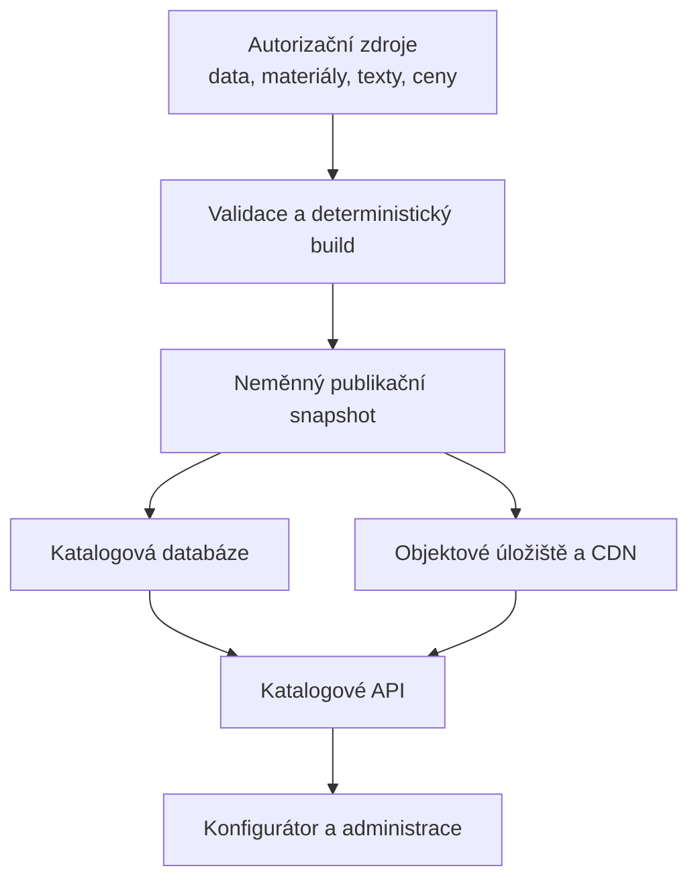
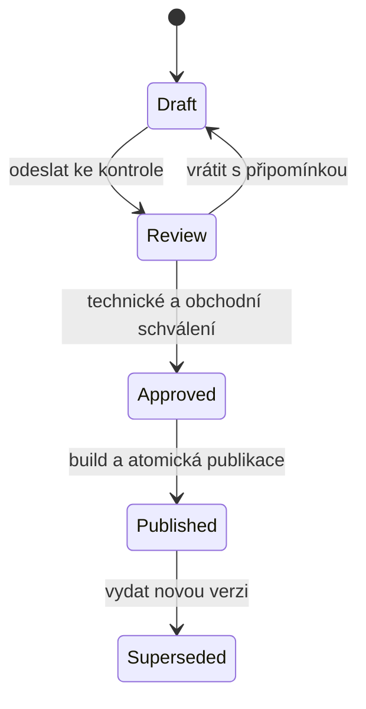

# Implementační návod pro produktový katalog a konfigurátor

## Zdrojové balíky panelů 1.1–1.4 a jejich udržitelné škálování

**Verze dokumentu:** 1.0  
**Datum:** 30. 8. 2026  
**Určení:** podklad pro návrh databáze, administračního rozhraní, publikačního procesu a integrace webového konfigurátoru  
**Charakter dokumentu:** doporučená architektura a principy; nejde o závazný předpis konkrétního technologického stacku

---

## 1. Cíl

Cílem je vytvořit produktový katalog, ve kterém lze dlouhodobě a bezpečně:

- přidávat další panely, stropy, podlahy a jiné typizované skladby;
- měnit technické údaje, vrstvy, vlastnosti a rozsah dodávky;
- spravovat ceny a cenové vzorce nezávisle na technické dokumentaci;
- vyměňovat nebo přegenerovávat obrázky bez porušení vazeb na produkt;
- zobrazovat vrstvy interaktivně v konfigurátoru;
- zachovat společné měřítko, kameru, materiály a grafický styl;
- dohledat, která přesná verze produktu, ceny a vizualizace byla použita v konkrétní konfiguraci nebo nabídce;
- publikovat změny řízeně, s kontrolou a možností návratu k předchozí verzi.

Nejdůležitější pravidlo zní:

> **Editují se pouze zdrojová data. Modely, rendery, tabulky, masky a webové manifesty jsou odvozené výstupy a vždy se znovu generují. Publikovaný produkt je neměnný verzovaný snapshot.**

## 2. Doporučení v jedné větě

Použít centrální verzovaný katalog v relační databázi, binární soubory držet v objektovém úložišti/CDN, generátory a validační schémata verzovat v repozitáři a konfigurátoru předávat jediný publikovaný snapshot, který pevně propojí technickou, obchodní, obsahovou a obrazovou verzi produktu.

Pro tuto velikost řešení není nutná soustava mikroslužeb. Dobře navržený modulární backend s relační databází, objektovým úložištěm a automatizovaným buildem je plně dostačující a snáze udržitelný.

---

## 3. Co již současné zdrojové balíky správně oddělují

Balíky `panel_source_1_1` až `panel_source_1_4` už obsahují vhodný základ pro budoucí systém:

| Část balíku | Současná role | Cílová role v katalogu |
|---|---|---|
| `data/panel_*.json` | technická definice panelu, vrstvy, rozsah dodávky | importní/autorizační zdroj technické verze produktu |
| `data/render_standard.json` | kamera, měřítko, souřadnice, rozměry výstupů | centrálně verzovaný vizuální standard |
| `data/material_library.json` | parametry materiálů pro rendering | odkazy na centrální registr verzovaných materiálů |
| `assets/materials/` | zdrojové textury | master soubory materiálové knihovny |
| `scripts/` | tvorba geometrie, tabulek a renderů | deterministický build nástroj používaný lokálně i v CI |
| `output/models/` | model v reálném měřítku | odvozené médium dané technické verze |
| `output/photoreal/` | složený, řezový a rozložený stav | webová sada vizualizací |
| `output/photoreal/layers/` | samostatné obrazové vrstvy | interaktivní sprity svázané přes `layer_id` |
| `output/photoreal/masks/` | masky jednotlivých vrstev | hit-test a zvýraznění vrstvy na webu |
| `*_asset_manifest.json` | mapa obrázků, stavů a vrstev | strojově čitelný kontrakt mezi buildem a webem |
| `output/validation/` | geometrické a datové kontroly | důkaz, že konkrétní build splnil publikační podmínky |

Adresář `output/` se nemá stát druhým místem pro ruční úpravy. Jeho obsah musí být kdykoliv reprodukovatelný ze zdrojové definice, konkrétních verzí materiálů, generátorů a renderovacího standardu.

---

## 4. Výchozí produktová data panelů 1.1–1.4

Následující přehled slouží kodérovi jako kontrolní základ migrace. Počet vrstev je počet logických vrstev zobrazovaných uživateli; výplň vložená do rámu nezvyšuje celkovou tloušťku podruhé.

| Panel | Dodávaná tloušťka | Logické vrstvy | Elektroinstalační příprava | Hranice dodávky a zásadní vizuální pravidlo |
|---|---:|---:|---|---|
| **1.1** | 341,0 mm | 10 | součástí jsou chráničky a vývrty pro pozdější krabice v 40mm předstěně | interiér končí surovým Fermacellem; exteriér armovací stěrkou 3 mm bez finální omítky |
| **1.2** | 398,5 mm | 11 | součástí jsou chráničky a vývrty pro pozdější krabice v 40mm předstěně | interiér končí surovým Fermacellem; exteriér dvojitým roštem, fasádní prkna nejsou dodána |
| **1.3** | 225,5 mm | 6 | zcela zajišťuje klient | dodán otevřený 40mm rošt; klient doplní elektro-přípravu, izolaci, vnitřní Fermacell i povrch; exteriér končí surovým Fermacellem |
| **1.4** | 84,0 mm | 1 | projektové vývrty s chráničkami a vývrty pro krabice jsou přímo v CLT | třívrstvý CLT 28/28/28 mm; interiér jednostranně pohledový, celistvý a bez zobrazených spár; bez izolace a fasády |

Pro panely 1.1, 1.2 a 1.4 nejsou součástí dodávky elektroinstalační krabice, kabeláž, koncové přístroje, zapojení ani revize. Tyto položky mají být vedeny strukturovaně, nikoliv pouze ukryté v poznámce.

---

## 5. Jeden katalog, několik ohraničených zdrojů pravdy

„Jeden zdroj pravdy“ neznamená jeden obří JSON se vším. Znamená to, že pro každý druh informace existuje právě jedno autoritativní místo a ostatní části na něj pouze odkazují.

| Oblast | Autoritativní zdroj | Může se verzovat nezávisle? | Příklad změny |
|---|---|---:|---|
| Identita produktu | `product` | zpravidla ne | kód 1.1, interní ID, kategorie |
| Technická skladba | `technical_version` | ano | změna tloušťky, vrstvy, rozsahu dodávky |
| Materiál | `material_version` | ano | textura, fyzikální vlastnost, dodavatel |
| Textový obsah | `content_version` | ano | uživatelský popis, výhody, vysvětlivka |
| Ceny a pravidla | `price_version` / ceník | ano | cena za m², marže, platnost, region |
| Vizuální pravidla | `visual_standard_version` | ano, ale zřídka | kamera, měřítko, rozměr plátna |
| Konkrétní média | `asset_set_version` | ano | nový render nebo optimalizovaný WebP |
| Publikace | `publication_snapshot` | vzniká vždy | pevně spojí výše uvedené verze |

### Tři vrstvy systému



1. **Autorizační vrstva** obsahuje editovatelná zdrojová data a master materiály.
2. **Build vrstva** provede validaci, vytvoří modely, obrázky, sprity, masky a manifest.
3. **Publikační vrstva** atomicky zpřístupní přesné verze dat i médií konfigurátoru.

Vývojový repozitář může být autoritativním místem pro schémata, generátory a master soubory. Běžná produktová a cenová administrace však má probíhat přes databázi a administrační rozhraní, nikoliv ručním přepisováním souborů na produkčním serveru.

---

## 6. Doporučený doménový model

Názvy tabulek jsou ilustrativní. Podstatné jsou hranice odpovědnosti a vazby.

### 6.1 Identita produktu

`products`

- `id` – neměnné interní UUID nebo stabilní slug, například `wall-panel-1-1`;
- `display_code` – obchodní kód `1.1`, který lze zobrazovat uživateli;
- `product_type` – například `external_wall_panel`;
- `category_id`;
- `status` – `draft`, `active`, `retired`;
- `created_at`, `created_by`.

Interní identita se nesmí odvozovat z názvu souboru ani z aktuálního marketingového názvu. Kód `1.1` je vhodný pro komunikaci, ale interní ID je bezpečnější pro databázové vazby.

### 6.2 Technická verze

`product_technical_versions`

- `id`, `product_id`;
- `version` – například `1.0.0`;
- `schema_version` – verze datového kontraktu, nikoliv výrobku;
- `name`, `category`, `declared_delivered_thickness_mm`;
- `direction` – u stěn vždy explicitně `interior_to_exterior`;
- `derived_from_product_id` a případně `derived_from_version_id`;
- `status` – `draft`, `in_review`, `approved`, `published`, `superseded`;
- `valid_from`, `valid_to`, `change_note`;
- reference na podklady a schvalující osobu.

Publikovanou technickou verzi nikdy neupravovat na místě. Oprava vytvoří další verzi a původní zůstane dostupná pro historické nabídky.

### 6.3 Vrstvy skladby

`product_layers`

- `technical_version_id`;
- `layer_id` – stabilní ID v rámci technické verze, například `L06`;
- `position` – pořadí od interiéru k exteriéru;
- `name`, `function`;
- `material_version_id`;
- `thickness_mm`;
- `host_layer_id` – rám, ve kterém se vrstva nachází;
- `additive_to_total` – zda se započítává do celkové tloušťky;
- `geometry_type` – deska, membrána, rám, výplň rámu, rošt, masivní panel apod.;
- geometrické parametry, například průřez, rozteč nebo orientace vláken;
- `derived_from_layer_id` pro dohledání původu varianty;
- lokalizovaný popis a případné technické vlastnosti.

Zásadní je zachovat dvojici `host_layer_id` + `additive_to_total`. Například minerální izolace tloušťky 160 mm vložená do rámu tloušťky 160 mm je samostatná logická a interaktivní vrstva, ale **nesmí** přidat dalších 160 mm k celkové skladbě.

### 6.4 Centrální registr materiálů

`materials` a `material_versions`

- stabilní `material_id`, například `kvh_spruce`, `fermacell_raw` nebo `clt_spruce_visual`;
- obchodní a technický název;
- výrobce a produktová řada, pokud jsou určeny;
- technické vlastnosti s jednotkami a zdrojem hodnoty;
- třída reakce na oheň, tepelná vodivost, objemová hmotnost apod.;
- externí kódy v samostatné mapě, například `cadwork`, ERP nebo dodavatelský kód;
- odkaz na aktuální master texturu a její fyzické měřítko;
- verze, stav schválení a původ dat.

Současné objekty `materials` vložené v každém `panel_*.json` je vhodné při importu nahradit referencí na centrální registr. Barva nebo textura téhož Fermacellu se pak nezmění pouze u jednoho panelu omylem.

Externí kód CADwork nebo ERP má být mapováním, nikoliv jedinou identitou materiálu. Tím systém zůstane funkční i při změně externího softwaru nebo číselníku.

### 6.5 Vlastnosti a rozsah dodávky

Volný text `delivery_note` je užitečný pro čtenáře, ale nestačí pro logiku konfigurátoru. Doporučují se strukturované záznamy:

`product_features`

- stabilní `feature_id`, například `electrical_preparation`;
- typ a hodnota;
- hostitelské vrstvy;
- projektová podmínka;
- krátký a rozšířený lokalizovaný popis.

`delivery_scope_items`

- `item_id`, například `electrical_conduits`, `box_bores`, `wiring`, `facade_boards`;
- stav `included`, `excluded`, `client_supplied`, `optional` nebo `project_specific`;
- odpovědná strana `supplier`, `client`, `third_party`;
- související vrstva nebo vlastnost;
- případná podmínka či poznámka.

Z těchto dat lze generovat přehledné bloky „Součástí dodávky“, „Není součástí dodávky“ a „Zajišťuje klient“. Textové vysvětlení lze dále redakčně upravit, ale nesmí odporovat strukturovanému stavu.

### 6.6 Obsah pro web

`product_content_versions`

- lokalizace, například `cs-CZ`;
- název, krátký popis, delší vysvětlení, výhody a upozornění;
- texty k vlastnostem a rozsahu dodávky;
- SEO metadata, pokud jsou zapotřebí;
- verze a schvalovací stav.

Pokud budou texty měněny jen zřídka, lze je v první etapě držet v technické verzi. Oddělená obsahová verze je vhodná ve chvíli, kdy marketing nebo obchod potřebuje upravovat text bez vytvoření nové technické revize.

---

## 7. Cenová architektura

Ceny nedávat do technického JSON ani do obrazového manifestu. Technická verze říká **co výrobek je**, cenová verze říká **kolik stojí v určitém kontextu a období**.

### Doporučené entity

`price_books`

- název ceníku, měna dle ISO 4217, region, zákaznický segment;
- režim DPH a období platnosti;
- stav návrh/schváleno/publikováno.

`product_price_versions` nebo `price_rules`

- `product_id` a případně `technical_version_id`, pokud je cena vázaná na konkrétní konstrukci;
- cenová jednotka: `m2`, `m`, `piece`, `panel`, `service`;
- `valid_from`, `valid_to`;
- náklad materiálu, práce, režie a dopravy, pokud se mají sledovat;
- prodejní cena nebo reference na výpočetní vzorec;
- přirážka/marže, minimální cena a pravidla zaokrouhlení;
- podmínky podle rozměru, množství, regionu nebo zvolených doplňků;
- měna, daňový kód a stav schválení.

Peněžní částky ukládat jako přesný desetinný typ nebo v nejmenších měnových jednotkách, nikoliv jako binární `float`. DPH a cena bez DPH mají být explicitně rozlišitelné.

### Pravidla výpočtu

- Vzorec musí být verzovaný stejně jako ceník.
- Konfigurátor má vracet rozpad ceny a identifikátor použitého pravidla, aby byl výsledek vysvětlitelný.
- Nová cena nesmí potichu přepočítat již rozpracovanou nebo odeslanou nabídku.
- Konfigurační relace si uloží `price_version_id`, datum kalkulace a případnou dobu platnosti.
- Přecenění starší konfigurace musí být vědomá akce a vytvořit nový výsledek, nikoliv přepsat historii.

Centrální ceník materiálů lze využít pro interní nákladovou kalkulaci, ale veřejná prodejní cena produktu nemá být nutně prostým součtem materiálů. Musí umět zahrnout práci, výrobní proces, ztráty, režii, logistiku a obchodní pravidla.

---

## 8. Vizuální standard a média

### 8.1 Standard se řídí daty, nikoliv odhadem autora renderu

Současný standard `PREFA_SOPIK_RENDER_STD_01` definuje mimo jiné:

- jednotky v milimetrech;
- souřadný systém `x = šířka`, `y = interiér → exteriér`, `z = výška`;
- referenční výřez 625 × 900 mm;
- ortografickou kameru s pevnou polohou;
- společné limity scény;
- prezentační mezeru rozloženého stavu 30 mm, která se nezapočítává do tloušťky;
- výstup 1600 × 1600 px s transparentním pozadím.

Tento soubor má být centrálně verzován. Produkt pouze odkazuje na `visual_standard_version_id`. Případná výjimka musí být explicitní, odůvodněná a viditelná při schválení.

### 8.2 Sada médií

`asset_sets`

- `id`, `product_id`, `technical_version_id`;
- `material_version_ids` nebo hash uzamčené materiálové sestavy;
- `visual_standard_version_id`;
- verze renderovacího nástroje;
- `geometry_sha256` a hash vstupních dat;
- stav buildu a validace;
- datum vytvoření a původ.

`assets`

- `asset_set_id`;
- sémantická role, nikoliv jen cesta k souboru;
- formát, rozměr, průhlednost, velikost a checksum;
- CDN/object key;
- vazba na `layer_id` a stav `assembled`/`exploded`, pokud jde o vrstvu;
- alternativní text nebo textový klíč.

Doporučené role:

- `full` – plná geometrie;
- `assembled_cutaway` – složený stupňovitý řez;
- `exploded` – rozložené konstrukční skupiny;
- `layer_sprite` – samostatná obrazová vrstva;
- `layer_mask` – průhledná maska pro výběr;
- `model` – OBJ/glTF nebo jiný model v reálném měřítku;
- `layer_table` – export tabulky pro kontrolu nebo tisk;
- `review_sheet` a `validation_proof` – interní QA, zpravidla neveřejné.

Web nesmí skládat cesty typu `.../L01.webp` odhadem. Vždy načte konkrétní `asset_manifest`, který mapuje role a `layer_id` na publikované URL.

### 8.3 Materiálová knihovna

- Každý materiál má jeden schválený master, fyzické měřítko textury a renderovací parametry.
- Produktová vrstva odkazuje na konkrétní verzi materiálu.
- Aktualizace textury materiálu sama o sobě nemění starší publikované rendery.
- Systém umí vyhledat všechny produkty používající změněný materiál a nabídnout hromadný rebuild.
- CLT může mít různé vizuální režimy jedné konstrukce, například pohledovou podélnou, příčnou a nepohledovou lamelu, ale musí zůstat součástí stejné řízené knihovny.

### 8.4 Interaktivní zobrazení

Konfigurátor může využít současné sprity a masky bez potřeby renderovat 3D scénu v prohlížeči:

1. načte kompozitní stav panelu;
2. z manifestu získá seznam vrstev a jejich `layer_id`;
3. při najetí, klepnutí nebo výběru řádku zobrazí zvýrazněný sprite a popis stejného `layer_id`;
4. masku použije pro hit-test nad obrázkem;
5. přepnutí `assembled`/`exploded` zachová vybranou logickou vrstvu;
6. seznam vrstev se generuje z dat – nikdy není napevno nastaven na 10 nebo 11 položek.

Ovládání nesmí záviset pouze na hoveru. Stejná funkce musí být dostupná dotykem, klávesnicí a prostřednictvím tabulky vrstev. Tím zůstane řešení použitelné na mobilu i pro asistivní technologie.

### 8.5 Dvě úrovně vizuální konzistence

Je vhodné rozlišit:

- **renderovací standard** – kamera, geometrie, měřítko, materiál a nasvícení;
- **webový design systém** – typografie, barvy UI, karty, mezery, ikony, tabulky a chování interakcí.

Render nesmí obsahovat nadpisy a webové rámečky „zapečené“ do obrázku, pokud je může vykreslit UI. Čisté transparentní assety lze znovu použít v dalších částech webu a změna designu nevyžaduje nový technický render.

---

## 9. Publikační snapshot: jednotka integrity

Publikační snapshot je neměnný záznam, který pevně spojí:

- produkt;
- technickou verzi;
- obsahovou verzi;
- cenovou verzi nebo konkrétní publikovaný ceník;
- sadu médií;
- vizuální standard;
- datum, kanál a stav publikace.

Ilustrativní příklad:

```json
{
  "publication_id": "pub-wall-panel-1-1-2026-08-30-01",
  "product_id": "wall-panel-1-1",
  "display_code": "1.1",
  "channel": "web-cz",
  "technical_version_id": "tech-1-1-v1",
  "content_version_id": "content-1-1-cs-v1",
  "price_book_version_id": "price-cz-2026-q3-v2",
  "asset_set_version_id": "assets-1-1-tech-v1-render-v3",
  "visual_standard_version_id": "PREFA_SOPIK_RENDER_STD_01@1.0",
  "status": "published",
  "published_at": "2026-08-30T12:00:00Z"
}
```

Publikace má proběhnout v jedné databázové transakci až poté, co jsou nahrány všechny assety a všechny kontroly mají stav `PASS`. Uživatel tak nikdy neuvidí nová data se starými obrázky nebo naopak.

Přepsání stejného souboru na stejné CDN adrese není vhodné. Používat verzované nebo obsahově adresované cesty, například s `asset_set_id` či hashem; následně lze nastavit dlouhou cache bez rizika zastaralého obsahu.

---

## 10. Doporučené API pro konfigurátor

Konfigurátor nemá skládat produkt z několika nezávislých dotazů na „nejnovější“ verze. Katalogové API mu vrátí jeden konzistentní read-model publikace.

Příklad endpointů:

```text
GET /api/catalog/v1/products?category=external_wall_panel
GET /api/catalog/v1/products/1.1
GET /api/catalog/v1/publications/{publication_id}
POST /api/configurations/{id}/reprice
```

Odpověď detailu produktu má obsahovat zejména:

- identitu, název a kód;
- ID všech použitých verzí;
- seřazené vrstvy s `layer_id`, vlastnostmi a vazbou na materiál;
- vypočtenou celkovou tloušťku a deklarovanou tloušťku;
- strukturovaný rozsah dodávky;
- uživatelské texty;
- manifest vizualizací s publikovanými URL;
- aktuálně použitelnou cenu nebo pravidlo pro její výpočet;
- schopnosti UI, například dostupnost složeného a rozloženého stavu.

Do každé uložené konfigurace patří minimálně:

- `publication_id`;
- `technical_version_id`;
- `price_version_id`;
- `asset_set_version_id`;
- zvolené varianty a jejich stabilní ID;
- vstupní rozměry a množství;
- cenový rozpad a čas výpočtu.

Pokud se katalog změní, starší konfigurace se nadále zobrazí podle připnutého snapshotu. Nové hodnoty se použijí až po explicitní migraci nebo přecenění.

---

## 11. Administrační a redakční workflow

### Doporučený průběh změny



### Administrační rozhraní

Vhodné je rozdělit detail produktu na části:

- **Technická skladba** – vrstvy, tloušťky, hostitelské vazby, vlastnosti;
- **Rozsah dodávky** – zahrnuto, vyloučeno, zajišťuje klient;
- **Obsah** – názvy, vysvětlení a uživatelské poznámky;
- **Ceny** – ceníky, vzorce, platnost a nákladový rozpad;
- **Média** – náhledy, manifest, verze materiálů a stav buildu;
- **Kontroly a historie** – validační protokol, diff, schválení a audit.

Editor pracuje pouze s návrhem. Před publikací má vidět:

- rozdíl proti poslední publikované verzi;
- automaticky vypočtený dopad změny;
- novou tabulku vrstev a fotorealistický proof sheet;
- seznam produktů dotčených změnou společného materiálu;
- chyby a varování validačního systému.

Role mohou být například `editor`, `technical_reviewer`, `commercial_reviewer` a `publisher`. Každá změna má auditní stopu: kdo, kdy, co změnil a proč.

---

## 12. Dopad jednotlivých typů změn

| Změna | Nová technická verze | Nová cenová verze | Rebuild obrázků | Nový snapshot |
|---|:---:|:---:|:---:|:---:|
| pouze cena nebo marže | ne | ano | ne | ano |
| marketingový text bez změny významu dodávky | ne | ne | ne | ano, pokud je obsah verzován samostatně |
| rozsah dodávky nebo odpovědnost klienta | ano | podle dopadu | zpravidla ano kvůli tabulce a kontrole | ano |
| tloušťka, pořadí nebo materiál vrstvy | ano | podle dopadu | ano | ano |
| oprava textury bez technické změny | ne | ne | ano pro všechny dotčené produkty | ano |
| změna kamery či společného měřítka | ne | ne | ano pro celý katalog | ano |
| optimalizace formátu při shodném obrazu | ne | ne | pouze mediální build | ano nebo revize asset setu |

Tuto matici je vhodné implementovat jako pravidla dopadu, ne pouze jako provozní znalost jednoho kodéra.

---

## 13. Automatické validační podmínky

### Datový kontrakt

- Každý vstup odpovídá verzovanému JSON Schema nebo ekvivalentnímu schématu.
- Povinná pole, enumy, jednotky a datové typy jsou kontrolovány před uložením i v CI.
- `schema_version` popisuje formát dat; migrace schématu je oddělena od technické verze produktu.

### Geometrie a skladba

- Deklarovaná tloušťka se rovná součtu pouze vrstev s `additive_to_total = true`.
- Každý `host_layer_id` existuje a hostovaná výplň není započtena dvakrát.
- Pořadí vrstev je jednoznačné a odpovídá směru interiér → exteriér.
- Průřezy rámu a roštů odpovídají tloušťce vrstvy.
- CLT 1.4 zachovává logickou tloušťku 84 mm a interní skladbu 28/28/28 mm.

### Materiály a vlastnosti

- Každá vrstva odkazuje na existující schválenou verzi materiálu.
- Každá technická hodnota má jednotku; kritické hodnoty mohou mít i zdroj a datum ověření.
- Materiálové textury mají definované fyzické měřítko, barevný prostor a licenci/původ.

### Rozsah dodávky

- Stejná položka nemůže být současně `included` i `excluded`.
- Generovaný text nesmí tvrdit opak strukturovaných dat.
- Panel 1.3 nesmí vykazovat dodavatelskou elektro-přípravu ani dodanou výplň/zaklopení předstěny.
- Panely 1.1, 1.2 a 1.4 mohou obsahovat chráničky a vývrty, ale nikoliv automaticky krabice, kabeláž, přístroje, zapojení nebo revizi.

### Média a manifest

- Manifest obsahuje povinné kompozity a všechny publikované soubory existují.
- `layer_id` v manifestu přesně odpovídají technické verzi.
- Každá interaktivní vrstva má sprite i masku pro podporované stavy.
- Rozměr, transparentní pozadí, kamera a limity scény odpovídají vizuálnímu standardu.
- `geometry_sha256` a hash vstupů odpovídají buildu.
- Dřevěné konstrukční prvky neprostupují povrchovými deskami.
- Pohledová plocha CLT je vizuálně celistvá bez falešných panelových spár.

### Ceny

- Pravidlo má měnu, jednotku, období platnosti a stav schválení.
- Období publikovaných pravidel se nepřekrývají nejednoznačným způsobem.
- Výpočet je deterministický a vrací rozpad i identifikátory pravidel.
- Publikace neobsahuje chybějící cenu, pokud ji daný prodejní kanál vyžaduje.

Za publikační bránu považovat strojový stav `PASS`, nikoliv pouhou existenci obrázků.

---

## 14. Ilustrativní datový kontrakt technické verze

Příklad ukazuje požadovaný princip referencí. Není nutné přesně převzít názvy polí.

```json
{
  "schema_version": "2.0",
  "product_id": "wall-panel-1-3",
  "technical_version": "1.0.0",
  "derived_from": {
    "product_id": "wall-panel-1-1",
    "technical_version_id": "tech-1-1-v1"
  },
  "units": "mm",
  "direction": "interior_to_exterior",
  "declared_delivered_thickness_mm": 225.5,
  "layers": [
    {
      "layer_id": "L01",
      "position": 1,
      "material_version_id": "kvh_spruce@1.0",
      "thickness_mm": 40,
      "geometry_type": "frame",
      "additive_to_total": true,
      "derived_from_layer_id": "L02"
    }
  ],
  "feature_refs": ["electrical_preparation@client"],
  "delivery_scope_ref": "scope-wall-panel-1-3-v1",
  "visual_standard_version_id": "PREFA_SOPIK_RENDER_STD_01@1.0"
}
```

Varianta 1.3 má být odvozena proveniencí, nikoliv živou dědičností. Po vytvoření verze musí zůstat její snapshot stabilní; pozdější změna 1.1 se do 1.3 nesmí propsat bez řízené revize a kontroly dopadu.

---

## 15. Doporučená struktura repozitáře

Jedna možná struktura autorizačních zdrojů:

```text
catalog/
  schemas/
    product.schema.json
    material.schema.json
    price-rule.schema.json
    asset-manifest.schema.json
  standards/
    render/PREFA_SOPIK_RENDER_STD_01/1.0.json
  materials/
    kvh_spruce/
      material.json
      versions/1.0/
      assets/
  products/
    wall-panel-1-1/
      product.json
      technical/1.0.0.json
      content/cs-CZ/1.0.json
    wall-panel-1-2/
    wall-panel-1-3/
    wall-panel-1-4/
  pricing/
    pricebooks/
    rules/
  generators/
  tests/
  build/                 # dočasné, negitované
  dist/                  # vytvořený publikační balík
```

V produkci se vyhledávací a relační data importují do databáze a binární assety do objektového úložiště. Web nemá číst pracovní repozitář ani lokální relativní cesty z dnešních manifestů.

Doporučuje se také odstranit z distribuovaných balíků `__pycache__` a jiné lokální build artefakty.

---

## 16. Migrační cesta pro panely 1.1–1.4

### Etapa 1 – minimální bezpečný základ

1. Zafixovat současné čtyři balíky jako referenční seed data.
2. Definovat společné JSON Schema pro produkt, vrstvu, rozsah dodávky a asset manifest.
3. Zavést stabilní interní ID produktů, materiálů, vlastností a položek rozsahu dodávky.
4. Vytvořit centrální registr materiálů a odstranit jejich nekontrolované duplikace mezi panely.
5. Napsat importer dnešních `panel_*.json` a `*_asset_manifest.json`.
6. Uložit technické verze, asset sety a publikační snapshoty do katalogu.
7. Zajistit, aby konfigurátor četl produkt výhradně přes katalogové API.

### Etapa 2 – bezpečná editace a publikace

1. Přidat administrační formuláře řízené schématem.
2. Zavést draft/review/approve/publish workflow a auditní stopu.
3. Napojit generátory modelu, renderu, tabulky a manifestu do CI nebo build workeru.
4. Zobrazit automatický diff a proof sheet před schválením.
5. Publikovat data a média atomicky přes snapshot.

### Etapa 3 – obchod a škálování

1. Doplnit verzované ceníky, cenové vzorce a přecenění konfigurace.
2. Přidat správu lokalizovaného obsahu a externích identifikátorů.
3. Zavést analýzu dopadu změny společného materiálu nebo vizuálního standardu.
4. Přidat další produktové rodiny bez kopírování logiky pro jednotlivé kódy.

Pro první nasazení jsou nezbytné technická verze, centrální materiály, cenová verze, asset set, publikovaný snapshot a validace. Složitější CMS nebo plná automatizace render farmy může následovat později.

---

## 17. Doporučené provozní scénáře

### Změna ceny panelu 1.1

Vytvoří se nová cenová verze s datem platnosti. Technická verze a asset set zůstanou stejné. Nový publikační snapshot propojí stávající techniku a média s novým ceníkem. Rozpracované nabídky zůstanou připnuté ke staré ceně.

### Změna vrstvy panelu 1.2

Vznikne návrh nové technické verze. Validátor přepočítá tloušťku, build znovu vytvoří model, složený i rozložený render, všechny sprity, masky a tabulku. Po schválení vznikne nový asset set a teprve poté nový snapshot.

### Změna textury KVH

Vznikne nová verze materiálu `kvh_spruce`. Systém zobrazí dopad na 1.1, 1.2 a 1.3 a vyžádá rebuild jejich asset setů. Starší publikace dále odkazují na původní render a materiálovou verzi.

### Doplnění vlastnosti výrobku

Nová technická vlastnost se přidá jako strukturované pole nebo verzovaná vlastnost s jednotkou a zdrojem. Pokud ovlivňuje pouze tabulku, systém může přegenerovat tabulkové médium; pokud mění geometrii nebo materiál, spustí celý vizuální build.

---

## 18. Čemu se vyhnout

- Jednomu JSON souboru obsahujícímu techniku, ceny, texty i cesty k obrázkům bez samostatného verzování.
- Ručnímu přepisování PNG/WebP, tabulek nebo manifestů v produkčním adresáři.
- Kopírování stejného materiálu a jeho textury do každého produktu jako nezávislé hodnoty.
- Identifikaci produktu názvem složky, souboru nebo marketingovým názvem.
- Změně publikovaného záznamu na místě.
- Pevnému počtu vrstev nebo napevno zadaným cestám v komponentách webu.
- Automatickému načítání všech „nejnovějších“ verzí při otevření starší nabídky.
- Sčítání tlouštěk všech logických vrstev bez respektování hostovaných výplní.
- Ukládání pouze obrázku tabulky bez strukturovaných dat vrstev.
- Vkládání webové typografie a ovládacích prvků přímo do technického renderu.
- Publikaci souborů dříve, než je dostupný kompletní a validní snapshot.
- Bezkontrolnímu přenosu změny z rodičovského produktu do odvozené varianty.

---

## 19. Minimální „definition of done“ pro kodéra

První udržitelná implementace je hotová, pokud:

- všechny čtyři panely lze načíst společným schématem bez produktově specifického hardcodování;
- technická, cenová a mediální verze mají oddělené identity;
- vrstvy používají stabilní `layer_id`, pořadí, vazbu na materiál a hostitelskou geometrii;
- materiály jsou centrální a produkt je pouze referencuje;
- cena se mění bez zásahu do technických dat a renderů;
- technická změna vytvoří novou verzi a vyvolá správný rebuild;
- konfigurátor čte assety z manifestu, umí libovolný počet vrstev a propojí obrázek s tabulkou přes `layer_id`;
- uložená konfigurace uchová přesné ID publikace, techniky, ceny a médií;
- publikovaná verze je neměnná a lze ji znovu zobrazit;
- validační brána odmítne nekonzistentní tloušťku, chybějící asset, neexistující materiál nebo rozpor v rozsahu dodávky;
- kamera, měřítko, transparentní pozadí a materiálový styl jsou řízeny společným verzovaným standardem;
- změna je auditovatelná a před publikací schválená.

---

## 20. Doporučený první technický úkol

Nejlepší první krok není tvorba administrační obrazovky, ale malý „vertical slice“:

1. definovat katalogové schéma;
2. naimportovat panel 1.1;
3. uložit jeho technickou verzi, vrstvy, rozsah dodávky, asset set a cenu odděleně;
4. vytvořit publikační snapshot;
5. vrátit jej jedním API endpointem;
6. vykreslit z něj detail produktu a interaktivní vrstvy bez hardcodovaných cest;
7. zopakovat stejný import beze změny aplikační logiky pro 1.2, 1.3 a 1.4.

Pokud čtvrtý panel vyžaduje pouze jiná data a volitelnou schopnost (například elektro vývrty v CLT), nikoliv kopii celé UI komponenty, je základní architektura navržena správně.

---

## 21. Mapa současného balíku do cílového systému

| Dnešní zdroj | Importovat jako | Poznámka |
|---|---|---|
| `panel_source_*/data/panel_*.json` | `technical_version`, vrstvy, vlastnosti a rozsah dodávky | po importu normalizovat materiálové odkazy |
| `panel_source_*/data/material_library.json` | `material_version` a renderovací profil | sloučit společné materiály podle stabilního ID |
| `panel_source_*/data/render_standard.json` | `visual_standard_version` | všechny čtyři produkty mají odkazovat na společnou verzi |
| `panel_source_*/data/sources.json` | provenience technických údajů | zatím je zejména u CLT; model připravit pro všechny produkty |
| `panel_source_*/assets/materials/` | master assety materiálů | ukládat verzovaně, s hashem a původem |
| `panel_source_*/output/models/` | asset role `model` | odvozený soubor, neupravovat ručně |
| `panel_source_*/output/photoreal/` | `asset_set` + jednotlivé role | webové soubory přesunout do objektového úložiště/CDN |
| `*_asset_manifest.json` | runtime manifest asset setu | při publikaci přepsat lokální cesty na verzované URL |
| `panel_source_*/output/validation/` | build report a publikační důkaz | uchovat u konkrétního asset setu a technické verze |
| `panel_source_*/scripts/` | společný generátor katalogu | postupně odstranit kopie a parametrizovat jednu sadu nástrojů |

Výsledkem má být systém, ve kterém jsou panely 1.1–1.4 prvními čtyřmi záznamy stejného obecného produktového modelu, nikoliv čtyřmi samostatnými programátorskými výjimkami.
